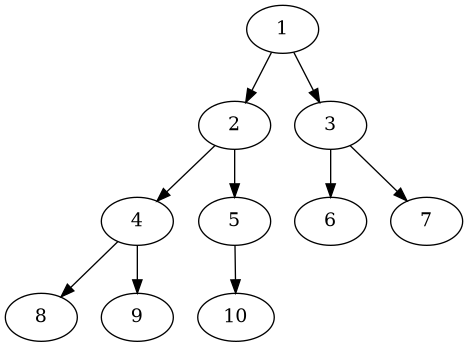

# LeetCodeGo

为了方便刷 LeetCode 的 Golang 脚手架

## 人性化的断言

```go
package main

import (
	"testing"

	. "github.com/LinWanCen/LeetCodeGo/assert"
)

func Test(t *testing.T) {
	AssertEqual(t, 1, 2)

	AssertEqualArr(t, []int{
		11, 222, 3,
	}, []int{
		1, 2,
	})

	AssertEqualMatrix(t, [][]int{
		{11, 22},
		{11, 222, 3},
	}, [][]int{
		{11, 222},
		{11, 22, 4},
	})
}
```

效果：
```
=== RUN   TestAssertEqualMatrix_value
AssertEqualMatrix:
[[11 22] [11 222 3]]
[[11 222] [11 22 4]]
     ^        ^  ^ 
    assert_test.go:25: 
        a[0][1]: 22 != b[0][1]: 222
        a[1][1]: 222 != b[1][1]: 22
        a[1][2]: 3 != b[1][2]: 4
--- FAIL: TestAssertEqualMatrix_value (0.00s)
```

## LeetCode 二叉树生成语法

```go
package TreeNode

import (
	"testing"

	. "github.com/LinWanCen/LeetCodeGo/TreeNode"
	. "github.com/LinWanCen/LeetCodeGo/assert"
)

func TestPathSum(t *testing.T) {
	root := NewTreeNode([]int{5, 4, 8, 11, Null, 13, 4, 7, 2, Null, Null, 5, 1})
	AssertEqualMatrix(t, pathSum(
		root, 22),
		[][]int{
			{5, 4, 11, 2},
			{5, 8, 4, 5},
		})
}

func pathSum(root *TreeNode, targetSum int) (ans [][]int) {
	return [][]int{}
}
```

```
=== RUN   TestName

@startuml TreeNode
digraph g {
           0 [label=" 1 "]
0  ->  1 ; 1 [label=" 2 "]
0  ->  2 ; 2 [label=" 3 "]
1  ->  3 ; 3 [label=" 4 "]
1  ->  4 ; 4 [label=" 5 "]
2  ->  5 ; 5 [label=" 6 "]
2  ->  6 ; 6 [label=" 7 "]
3  ->  7 ; 7 [label=" 8 "]
3  ->  8 ; 8 [label=" 9 "]
4  ->  9 ; 9 [label=" 10 "]
}
@enduml

--- PASS: TestName (0.00s)
PASS
```

### 生成树状图

需安装`Graphviz`

- Goland：粘贴`@startuml...@enduml`到`.puml`文件  
  [PlantUML integration 插件](https://plugins.jetbrains.com/plugin/7017-plantuml-integration/versions)
- VSCode：粘贴`digraph g {...}`到`dot`文件  
  [Graphviz Preview 拓展](https://marketplace.visualstudio.com/items?itemName=EFanZh.graphviz-preview)



## 链表

```go
package ListNode

import (
	"testing"

	. "github.com/LinWanCen/LeetCodeGo/ListNode"
	. "github.com/LinWanCen/LeetCodeGo/assert"
)

func TestReverseList(t *testing.T) {
  AssertEqualArr(t,
    ToArr(reverseList(NewListNode([]int{1, 2, 3, 4, 5}))),
    []int{5, 4, 3, 2, 1},
  )
}

func reverseList(head *ListNode) *ListNode {
	return head
}
```